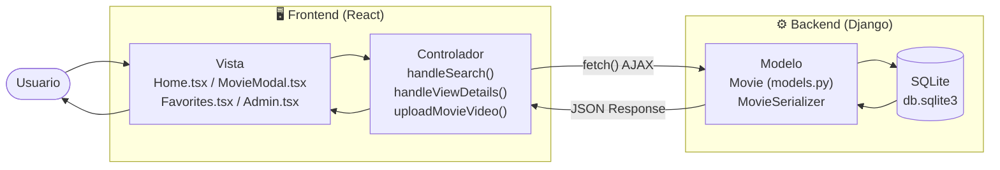
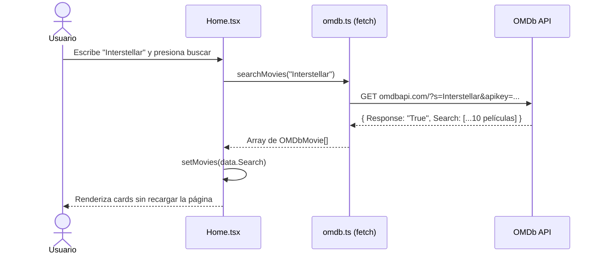
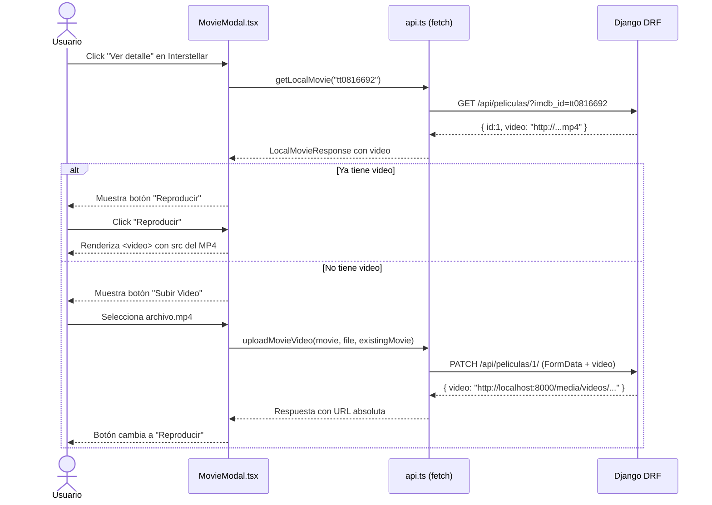

# Práctica #1 / Unidad II / Portafolio #2
## Sistema de Gestión de Películas tipo Netflix — **MovieStream**

---

> **Materia:** Tecnologías y Aplicaciones en Internet  

> **Alumno:** José Manuel Ortiz Medrano, Carlos Arturo Orozco Huitron

> **Grupo:** ISCO8A

> **Fecha de entrega:** 26 de Junio de 2026  

> **Institución:** Universidad Politecnica de Aguacalientes

---

## 1. Objetivo

Desarrollar una aplicación web dinámica tipo catálogo de películas, utilizando **React**, **TypeScript**, **Vite**, **Bootstrap 5**, y **Fetch API**, que permita consultar, visualizar, filtrar y administrar películas a través de la API pública de **OMDb** y un backend propio construido con **Python + Django REST Framework**, todo orquestado mediante **Docker Compose**.

---

## 2. Investigación y Análisis

### 2.1 Diferencia entre Librería y Framework

| Concepto | Descripción | Ejemplo |
|---|---|---|
| **Librería** | Conjunto de funciones reutilizables que el desarrollador invoca cuando las necesita. El control del flujo del programa lo tiene el propio código del programador. | Bootstrap, jQuery, Axios |
| **Framework** | Estructura completa que dicta el flujo del programa. El framework llama al código del desarrollador (inversión de control). | React, Django, Spring Boot |

> **Regla mnemotécnica:** Con una librería, *tú llamas al código*. Con un framework, *el código te llama a ti*.

---

### 2.2 ¿Qué es AJAX?

**AJAX** (Asynchronous JavaScript And XML) es una técnica de programación web que permite actualizar partes de una página sin necesidad de recargarla completamente. Funciona enviando peticiones HTTP en segundo plano desde el navegador.

**Flujo de AJAX:**
```
[Navegador] → Evento del usuario (ej. clic en buscar)
     ↓
[JavaScript] → Crea petición HTTP asíncrona
     ↓
[Servidor / API] → Procesa y responde con datos (JSON)
     ↓
[JavaScript] → Recibe la respuesta y actualiza el DOM
     ↓
[Usuario] → Ve los cambios sin haber recargado la página
```

---

### 2.3 ¿Cómo funciona `fetch()`?

`fetch()` es la función nativa de JavaScript moderna para realizar peticiones HTTP asíncronas. Devuelve una **Promise** que resuelve con la respuesta del servidor.

```javascript
// Ejemplo básico de fetch con async/await
const buscarPelicula = async (titulo) => {
  const url = `https://www.omdbapi.com/?s=${titulo}&apikey=TU_KEY`;
  
  const response = await fetch(url);        // 1. Espera la respuesta HTTP
  
  if (!response.ok) {                        // 2. Verifica que no hubo error
    throw new Error(`HTTP Error: ${response.status}`);
  }
  
  const data = await response.json();        // 3. Convierte a objeto JavaScript
  return data;                               // 4. Devuelve los datos
};
```

En el proyecto, esta función se usa en `frontend/src/services/omdb.ts` para toda la comunicación con la API de OMDb.

---

### 2.4 ¿Qué es JSON?

**JSON** (JavaScript Object Notation) es un formato de texto ligero para intercambio de datos. Es legible por humanos y fácilmente procesable por máquinas. Es el formato estándar que devuelven las APIs REST.

**Ejemplo — Respuesta real de la API OMDb para "Interstellar":**
```json
{
  "Title": "Interstellar",
  "Year": "2014",
  "Rated": "PG-13",
  "Released": "07 Nov 2014",
  "Runtime": "169 min",
  "Genre": "Adventure, Drama, Sci-Fi",
  "Director": "Christopher Nolan",
  "Actors": "Matthew McConaughey, Anne Hathaway, Jessica Chastain",
  "Plot": "When Earth becomes uninhabitable in the future, a farmer and ex-NASA pilot, Joseph Cooper, is tasked to pilot a spacecraft...",
  "imdbRating": "8.7",
  "imdbID": "tt0816692",
  "Response": "True"
}
```

---

### 2.5 ¿Qué es una API REST?

Una **API REST** (Representational State Transfer) es un conjunto de reglas arquitectónicas para construir servicios web. Las operaciones se realizan mediante métodos HTTP estándar:

| Método HTTP | Operación CRUD | Ejemplo en MovieStream |
|---|---|---|
| `GET` | **Leer** | `GET /api/peliculas/` → Lista películas |
| `POST` | **Crear** | `POST /api/peliculas/` → Sube nueva película + video |
| `PATCH` | **Actualizar parcial** | `PATCH /api/peliculas/1/` → Actualiza solo el video |
| `DELETE` | **Eliminar** | `DELETE /api/peliculas/1/` → Elimina película |

---

### 2.6 Características de las librerías/frameworks investigados

#### Bootstrap
- Framework CSS de código abierto desarrollado por Twitter.
- Sistema de grid de 12 columnas para layouts responsivos.
- Componentes preestilizados: modales, cards, navbar, botones.
- Requiere `<link>` CSS + JS bundle. En MovieStream: `Bootstrap 5.3.8`.

#### jQuery
- Librería JavaScript que simplifica manipulación del DOM, eventos y AJAX.
- Famosa por su sintaxis concisa: `$('#elemento').hide()`.
- Hoy considerada legacy; sus funciones están integradas en JavaScript moderno.

#### Material Design
- Sistema de diseño creado por Google en 2014.
- Basado en metáforas físicas: profundidad, sombras, animaciones.
- Implementación web: `MaterializeCSS` o `MUI` (para React).

#### Prototype
- Una de las primeras librerías JavaScript (2005). Precursora de jQuery.
- Extendía los prototipos nativos de JavaScript (`Array`, `String`, etc.).
- Actualmente obsoleta y sin soporte activo.

---

## 3. Diagramas

### 3.1 Arquitectura General — Cliente / Servidor

```
┌─────────────────────────────────────────────────────────┐
│                    DOCKER COMPOSE                         │
│                                                           │
│  ┌─────────────────────┐    ┌────────────────────────┐   │
│  │  FRONTEND            │    │  BACKEND               │   │
│  │  React + TypeScript  │    │  Python + Django        │   │
│  │  Vite 8 (Port 5173)  │◄──►│  DRF (Port 8000)       │   │
│  │                      │    │                        │   │
│  │  /          → Home   │    │  /api/peliculas/  GET  │   │
│  │  /favorites → Favs   │    │  /api/peliculas/  POST │   │
│  │  /admin     → CRUD   │    │  /api/peliculas/{id}/  │   │
│  │                      │    │  /media/videos/*.mp4   │   │
│  └──────────┬───────────┘    └──────────┬─────────────┘   │
│             │                           │                   │
└─────────────┼───────────────────────────┼───────────────────┘
              │                           │
              ▼                           ▼
    ┌──────────────────┐       ┌─────────────────────┐
    │  OMDb Public API │       │  SQLite DB +         │
    │  omdbapi.com     │       │  /media/ (videos)    │
    └──────────────────┘       └─────────────────────┘
```

### 3.2 Patrón MVC Simplificado



### 3.3 Flujo de Búsqueda con AJAX



### 3.4 Flujo de Subida y Reproducción de Video



---

## 4. Fragmentos de Código — Evidencias de Funcionamiento

### 4.1 Consumo de API con `fetch()` — AJAX (OMDb)

El sistema realiza búsquedas dinámicas a OMDb sin recargar la página usando `fetch()` con `async/await`:

```typescript
// frontend/src/services/omdb.ts
const API_KEY = import.meta.env.VITE_OMDB_API_KEY;
const BASE_URL = 'https://www.omdbapi.com/';

export const searchMovies = async (query: string): Promise<OMDbSearchResponse> => {
  if (!API_KEY || API_KEY === 'your_api_key_here') {
    throw new Error('VITE_OMDB_API_KEY no está configurada.');
  }
  const response = await fetch(`${BASE_URL}?s=${encodeURIComponent(query)}&apikey=${API_KEY}`);
  if (!response.ok) throw new Error(`OMDb error: ${response.status}`);
  return await response.json();
};

export const getMovieDetails = async (imdbID: string): Promise<OMDbMovieDetail> => {
  const response = await fetch(`${BASE_URL}?i=${encodeURIComponent(imdbID)}&apikey=${API_KEY}`);
  if (!response.ok) throw new Error(`OMDb error: ${response.status}`);
  return await response.json();
};
```

---

### 4.2 Búsqueda Dinámica — Sin Recargar la Página

Al recibir el evento de búsqueda, el estado de React se actualiza y los componentes se re-renderizan automáticamente:

```typescript
// frontend/src/pages/Home.tsx
const handleSearch = async (query: string) => {
  setLoading(true);
  setError('');
  setHasSearched(true);
  try {
    const data = await searchMovies(query);       // Petición AJAX
    if (data.Response === 'True' && data.Search) {
      setMovies(data.Search);                     // Actualiza estado → re-render
    } else {
      setMovies([]);
      setError(data.Error || 'No se encontraron resultados.');
    }
  } catch {
    setError('Error al conectar con la API.');
  } finally {
    setLoading(false);
  }
};
```

---

### 4.3 Favoritos con `localStorage`

Las películas favoritas persisten en el navegador aunque se cierre la pestaña:

```typescript
// frontend/src/hooks/useFavorites.ts
const STORAGE_KEY = 'favorites';

const loadFavorites = (): OMDbMovieDetail[] => {
  try {
    const saved = localStorage.getItem(STORAGE_KEY);
    return saved ? JSON.parse(saved) : [];
  } catch {
    localStorage.removeItem(STORAGE_KEY);
    return [];
  }
};

export const useFavorites = () => {
  const [favorites, setFavorites] = useState<OMDbMovieDetail[]>(loadFavorites);

  const addFavorite = useCallback((movie: OMDbMovieDetail) => {
    setFavorites(prev => {
      if (prev.some(fav => fav.imdbID === movie.imdbID)) return prev; // Evita duplicados
      const updated = [...prev, movie];
      localStorage.setItem(STORAGE_KEY, JSON.stringify(updated));     // Persiste
      return updated;
    });
  }, []);

  const removeFavorite = useCallback((imdbID: string) => {
    setFavorites(prev => {
      const updated = prev.filter(fav => fav.imdbID !== imdbID);
      localStorage.setItem(STORAGE_KEY, JSON.stringify(updated));
      return updated;
    });
  }, []);

  const isFavorite = useCallback(
    (imdbID: string) => favorites.some(fav => fav.imdbID === imdbID),
    [favorites]
  );

  return { favorites, addFavorite, removeFavorite, isFavorite };
};
```

---

### 4.4 Panel de Administración — CRUD con `localStorage`

```typescript
// frontend/src/pages/Admin.tsx (extracto)
const handleSubmit = (e: React.FormEvent) => {
  e.preventDefault();
  if (editingId) {
    // Editar película existente
    updateMovie(editingId, formData);
    setEditingId(null);
  } else {
    // Crear nueva película
    addMovie({ ...formData, id: crypto.randomUUID() });
  }
  setFormData(INITIAL_FORM);
};

const deleteMovie = (id: string) => {
  if (confirm('¿Eliminar esta película?')) {
    removeMovie(id);
  }
};
```

---

### 4.5 Modelo de Datos — Backend Django

```python
# backend/movies/models.py
from django.db import models
from django.core.validators import MinValueValidator, MaxValueValidator, FileExtensionValidator
from datetime import datetime

def _max_year():
    return datetime.now().year + 5

class Movie(models.Model):
    imdb_id     = models.CharField(max_length=50, blank=True, null=True, unique=True)
    titulo      = models.CharField(max_length=255)
    genero      = models.CharField(max_length=100)
    anio        = models.IntegerField(
                    validators=[MinValueValidator(1888), MaxValueValidator(_max_year)])
    duracion    = models.CharField(max_length=50)
    director    = models.CharField(max_length=255)
    calificacion= models.FloatField(validators=[MinValueValidator(0.0), MaxValueValidator(10.0)])
    descripcion = models.TextField()
    poster      = models.URLField(max_length=500, blank=True, null=True)
    video       = models.FileField(
                    upload_to='videos/', blank=True, null=True,
                    validators=[FileExtensionValidator(['mp4', 'webm', 'ogg'])])

    class Meta:
        ordering = ['-anio', 'titulo']

    def __str__(self):
        return self.titulo
```

---

### 4.6 API REST — Endpoint de Películas

```python
# backend/movies/views.py
from rest_framework import viewsets, filters
from .models import Movie
from .serializers import MovieSerializer

class MovieViewSet(viewsets.ModelViewSet):
    queryset = Movie.objects.all()
    serializer_class = MovieSerializer
    filter_backends = [filters.SearchFilter, filters.OrderingFilter]
    search_fields = ['titulo', 'director', 'genero']
    ordering_fields = ['titulo', 'anio', 'calificacion']
    ordering = ['-anio']

    def get_queryset(self):
        queryset = super().get_queryset()
        imdb_id = self.request.query_params.get('imdb_id')
        if imdb_id:
            queryset = queryset.filter(imdb_id=imdb_id)
        return queryset
```

**Respuesta JSON real del endpoint `GET /api/peliculas/?imdb_id=tt0816692`:**
```json
{
  "count": 1,
  "next": null,
  "previous": null,
  "results": [
    {
      "id": 1,
      "imdb_id": "tt0816692",
      "titulo": "Interstellar",
      "genero": "Adventure, Drama, Sci-Fi",
      "anio": 2014,
      "duracion": "169 min",
      "director": "Christopher Nolan",
      "calificacion": 8.7,
      "descripcion": "When Earth becomes uninhabitable in the future...",
      "poster": "https://m.media-amazon.com/images/...",
      "video": "http://localhost:8000/media/videos/pelicula.mp4"
    }
  ]
}
```

---

### 4.7 Docker Compose — Orquestación de Contenedores

```yaml
# docker-compose.yml
services:
  backend:
    build: ./backend
    ports:
      - "8000:8000"
    volumes:
      - ./backend:/app       # Persiste DB y archivos de video
    environment:
      - DJANGO_SECRET_KEY=django-insecure-dev-key
      - DJANGO_DEBUG=True
      - CORS_ALLOWED_ORIGINS=http://localhost:5173
    restart: unless-stopped

  frontend:
    build: ./frontend
    ports:
      - "5173:5173"
    volumes:
      - ./frontend:/app
      - /app/node_modules
    environment:
      - VITE_API_URL=http://localhost:8000/api/peliculas/
    depends_on:
      - backend
    restart: unless-stopped
```

---

## 5. Aprendizajes y Dificultades

### Aprendizajes obtenidos

1. **Arquitectura Cliente-Servidor con Docker:** Aprendí a separar responsabilidades entre el frontend (React) y el backend (Django) en contenedores independientes que se comunican a través de la red interna de Docker. Esto simula un entorno de producción real.

2. **AJAX con `fetch()` y async/await:** Implementé búsquedas dinámicas sin recargar la página. Entendí la diferencia entre código síncrono y asíncrono, y cómo las Promises permiten manejar respuestas del servidor de forma ordenada.

3. **API REST con Django REST Framework:** Construí un backend completo con endpoints para crear, leer, actualizar y eliminar películas, incluyendo subida de archivos de video (multipart/form-data).

4. **Persistencia de datos:** Usé dos mecanismos de persistencia distintos: `localStorage` en el navegador para favoritos y el panel de administración escolar, y la base de datos SQLite de Django para los videos subidos.

5. **TypeScript:** El tipado estático me ayudó a detectar errores antes de ejecutar el código. Por ejemplo, definir la interfaz `OMDbMovieDetail` obligó a que todos los componentes manejaran correctamente los datos de la API.

### Dificultades encontradas

1. **CORS (Cross-Origin Resource Sharing):** Al principio, el navegador bloqueaba las peticiones del frontend (puerto 5173) hacia el backend (puerto 8000) por ser orígenes distintos. Lo resolví instalando `django-cors-headers` y configurando `CORS_ALLOWED_ORIGINS`.

2. **Respuesta paginada de Django REST Framework:** El GET de películas devuelve un objeto `{ count, results: [...] }` en lugar de un array directo. El código del frontend fallaba porque intentaba leer `data[0]` directamente. Fue necesario detectar si la respuesta era paginada o un array plano y manejarlo en `api.ts`.

3. **POST vs PATCH en la subida de video:** Al intentar subir un video para una película que ya existía en la base de datos, Django devolvía un error 400 porque `imdb_id` es único. Solución: implementar una lógica *upsert* que hace `PATCH` si la película existe, y `POST` solo si es nueva.

4. **Servidores de archivos de media en Django:** Los archivos de video solo se sirven automáticamente cuando `DEBUG=True`. Fue necesario configurar `MEDIA_URL` y `MEDIA_ROOT` correctamente y añadir el patrón de URL con `django.conf.urls.static`.

5. **Estado de reproducción entre películas:** Si el usuario abría una película y daba play, cerraba el modal y abría otra película, el reproductor aparecía inmediatamente activo. Esto se solucionó reseteando el estado `isPlaying` dentro del `useEffect` que depende de la película seleccionada.

---

## 6. Conclusiones Individuales

El desarrollo de **MovieStream** representó un proyecto integrador que va más allá de crear una interfaz visual. Implicó diseñar y conectar dos sistemas completamente distintos —un frontend moderno en React y un backend REST en Django— y hacerlos convivir de forma ordenada dentro de contenedores Docker.

Uno de los aprendizajes más valiosos fue comprender que el consumo de APIs no se limita a hacer un `fetch()` y mostrar datos. Requiere manejar estados de carga, errores de red, respuestas inesperadas del servidor, diferencias de formato entre APIs (OMDb vs. nuestro propio Django) y decisiones de arquitectura como cuándo usar `localStorage` versus una base de datos real.

La práctica también evidenció la importancia de las herramientas de desarrollo modernas. TypeScript detectó varios errores antes de ejecutar el código. Docker garantizó que el proyecto funcione en cualquier computadora sin instalar dependencias manualmente. Y React con Vite hizo posible ver los cambios reflejados en el navegador en tiempo real mientras se desarrollaba.

Finalmente, comprendí que un sistema de software es la suma de sus capas: diseño, datos, lógica y comunicación. Cuando una de esas capas falla —como el serializer que devolvía rutas relativas en lugar de URLs absolutas para los videos— toda la cadena se rompe. Aprender a rastrear ese tipo de errores desde el navegador hasta la base de datos es una habilidad fundamental de cualquier desarrollador web.

---

## 7. Bibliografía

1. Mozilla Developer Network. (2024). *Fetch API*. MDN Web Docs. https://developer.mozilla.org/es/docs/Web/API/Fetch_API

2. Mozilla Developer Network. (2024). *Window.localStorage*. MDN Web Docs. https://developer.mozilla.org/es/docs/Web/API/Window/localStorage

3. Django Software Foundation. (2024). *Django REST Framework — ModelViewSet*. https://www.django-rest-framework.org/api-guide/viewsets/#modelviewset

4. OMDb API. (2024). *The Open Movie Database — API Documentation*. https://www.omdbapi.com/

5. Bootstrap. (2024). *Bootstrap 5.3 — Documentation*. https://getbootstrap.com/docs/5.3/

6. React. (2024). *React Docs — useEffect, useState, useCallback*. https://react.dev/reference

7. Docker Inc. (2024). *Docker Compose — Overview*. https://docs.docker.com/compose/

8. Shklar, L. & Rosen, R. (2009). *Web Application Architecture: Principles, Protocols and Practices*. John Wiley & Sons.

9. Fielding, R. T. (2000). *Architectural Styles and the Design of Network-based Software Architectures* (Tesis doctoral). University of California, Irvine. https://www.ics.uci.edu/~fielding/pubs/dissertation/top.htm
